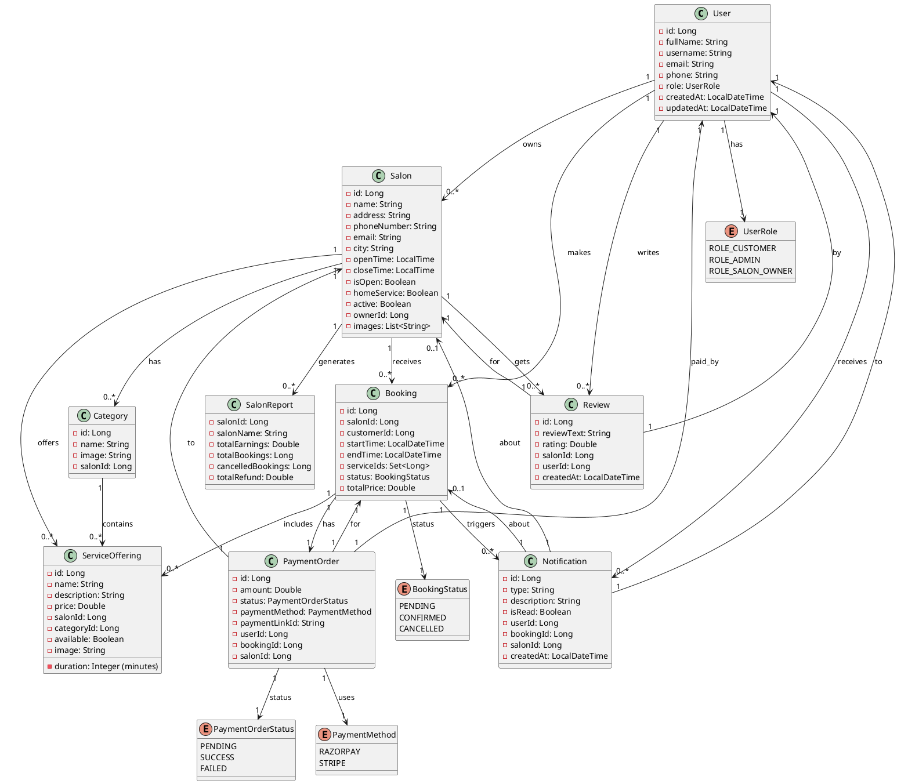
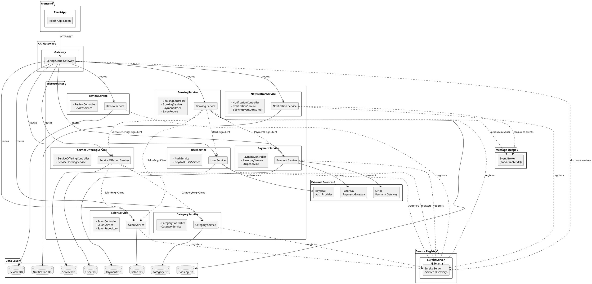
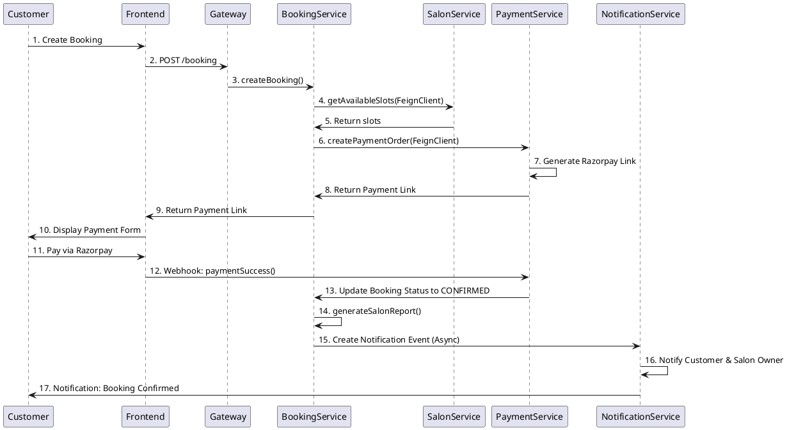

# Salon Booking Project - UML Diagrams

## 1. Domain Model Class Diagram



## 2. Microservices Architecture Diagram



## 3. Booking Flow Sequence Diagram



## 4. Component Dependencies

| Service | Depends On | Communication |
|---------|-----------|----------------|
| **Booking** | User, Salon, ServiceOffering, Payment | Feign Clients |
| **ServiceOffering** | Salon, Category | Feign Clients |
| **Payment** | External (Razorpay, Stripe) | HTTP |
| **Notification** | Booking Events | Message Queue |
| **Review** | User, Salon | Direct References |
| **Category** | Salon | Direct References |
| **User** | Keycloak | OAuth2 |
| **Salon** | None (Independent) | - |
| **Gateway** | Eureka, All Services | Service Discovery |

## 5. Technology Stack

- **Backend Framework**: Spring Boot + Spring Cloud
- **Service Discovery**: Spring Cloud Eureka
- **API Gateway**: Spring Cloud Gateway
- **Authentication**: Keycloak + OAuth2
- **Inter-service Communication**: Feign Clients
- **Payment Processing**: Razorpay & Stripe APIs
- **Messaging**: Kafka/RabbitMQ (for async events)
- **Database**: Per-service databases (Database per Service pattern)
- **Containerization**: Docker (docker-compose.yml for orchestration)

## 6. Deployment Architecture

```
┌─────────────────────────────────────────────────────────────┐
│                     Docker Compose                          │
├─────────────────────────────────────────────────────────────┤
│                                                             │
│  ┌─────────────┐  ┌─────────────┐  ┌─────────────┐        │
│  │   User DB   │  │  Booking DB │  │  Payment DB │        │
│  │ (PostgreSQL)│  │(PostgreSQL) │  │(PostgreSQL) │        │
│  └──────┬──────┘  └──────┬──────┘  └──────┬──────┘        │
│         │                │                │                │
│  ┌──────────────────────────────────────────────────┐      │
│  │           Service Containers                    │      │
│  ├──────────────────────────────────────────────────┤      │
│  │ UserService  SalonService  BookingService       │      │
│  │ PaymentService  NotificationService  ...        │      │
│  └──────────────────────────────────────────────────┘      │
│                          │                                 │
│  ┌──────────────────────────────────────────────────┐      │
│  │  Gateway (Port 8080)                             │      │
│  └──────────────────────────────────────────────────┘      │
│                          │                                 │
└──────────────────────────┼─────────────────────────────────┘
                           │
                   ┌───────┴────────┐
                   │                │
            ┌──────────────┐  ┌──────────────┐
            │   Frontend   │  │  Keycloak    │
            │   (React)    │  │  (OAuth2)    │
            └──────────────┘  └──────────────┘
```

